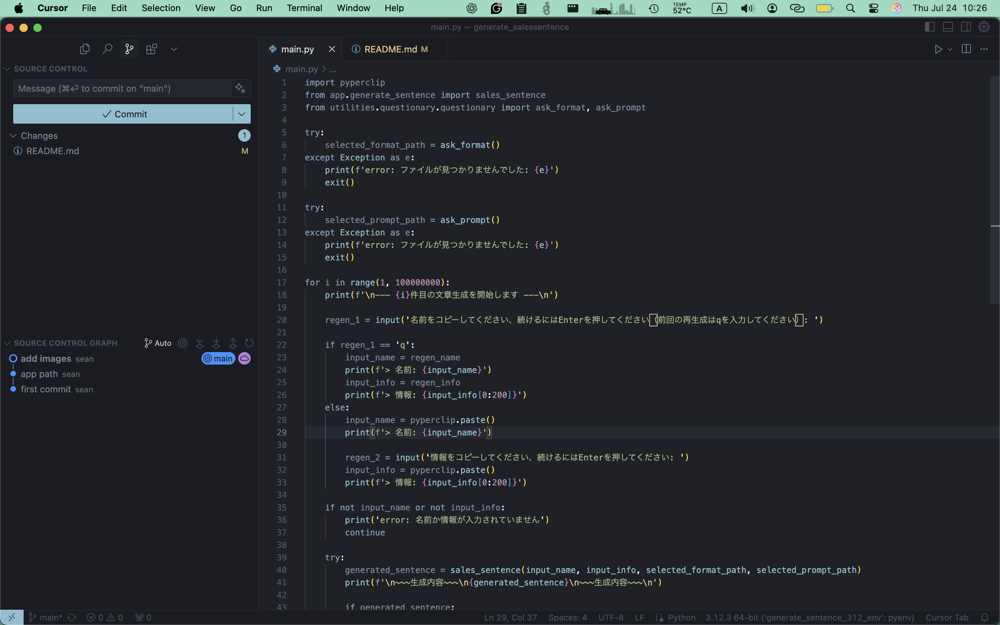
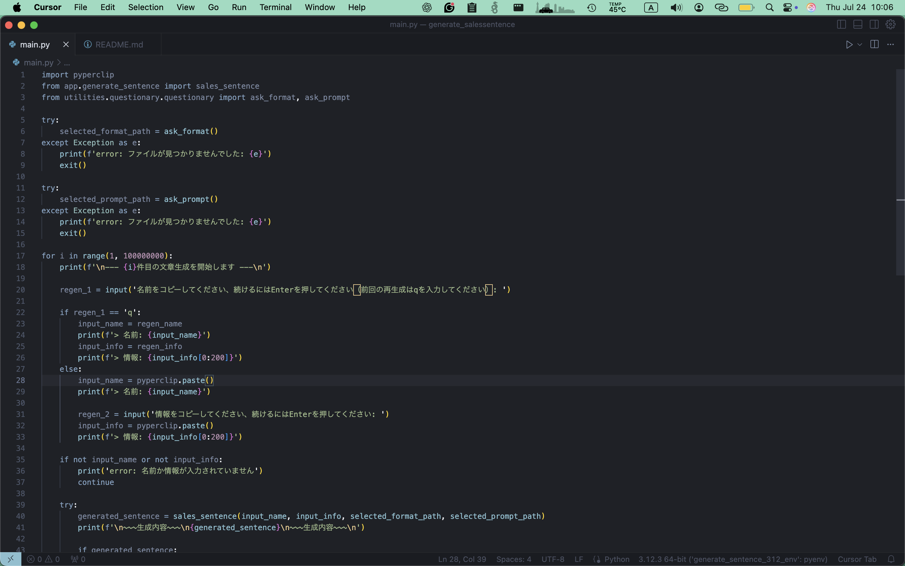
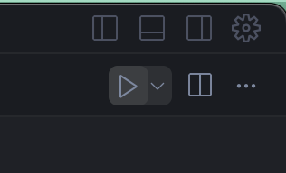
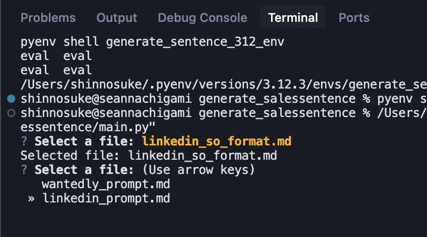

# 営業文自動生成ツール

## 📌 概要
このプロジェクトは、営業を行う際の営業文の自動生成を補助してくれるツールになります。

## 🖼️ デモ
(demo/0724_demo.mp4)

---

## 🚀 はじめに（Getting Started）

### 🛠️ インストール方法（Installation）

**ステップ1**  
GitHubプロジェクトのクローン：
```bash
git clone https://github.com/sean-mendous/generate_salessentence.git
```

**ステップ2**
仮想環境の作成（pyenv + virtualenv を使用）：
```bash
pyenv virtualenv 3.12.3 generate_sentence_312_env
pyenv activate
```

**ステップ3**
ライブラリのインストール：
```bash
cd generate_salessentence
pip install -r requirements.txt
```

**ステップ4**
環境変数ファイル（.env）の配置：
Slackで共有しているファイルを、そのままプロジェクトフォルダに投入してください。

✅ 準備完了！

⸻

### ▶️ 使い方

**ステップ1**
main.py を VS Code 等で開く


**ステップ2**
右上の ▶️ ボタンを押してプログラムを開始


**ステップ3**
使用する「prompt」と「format」を選択（矢印キーと Enter キーで選択）


**ステップ4**
送信者の「名前」を入力
コピーを終えたら Enter を押してください。コピペは不要です（壊れる可能性があります）。


**ステップ5**
カスタマイズ用の「情報」を入力
コピーを終えたら Enter を押してください。コピペは不要です（壊れる可能性があります）。


**ステップ6**
生成を待ちます（5～10秒）。完了後、自動的に文面がコピーされますので、そのまま貼り付けてください。
再生成したい場合は、名前入力画面で q を入力し、Enter を押してください。